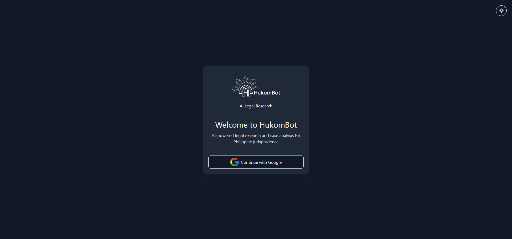
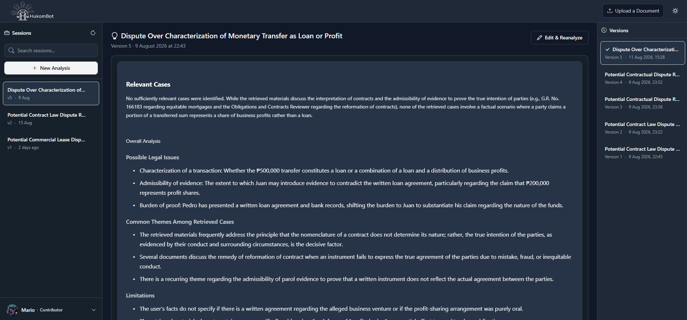
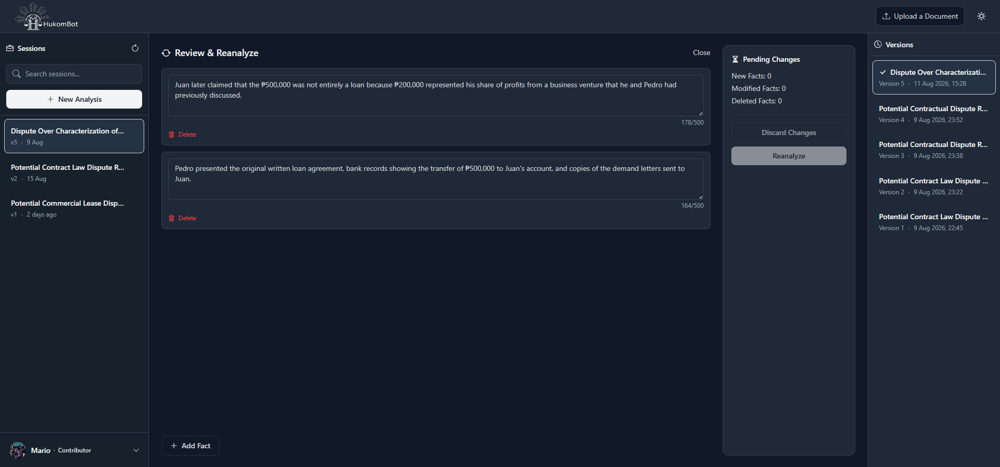
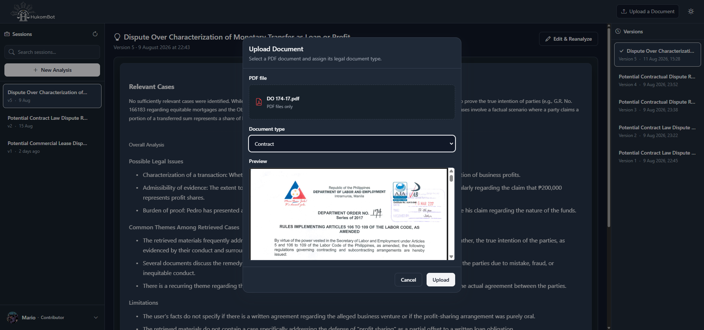
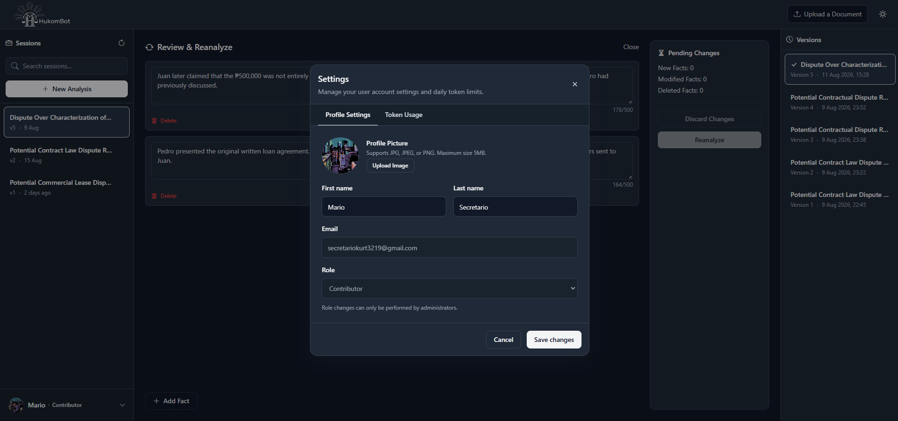
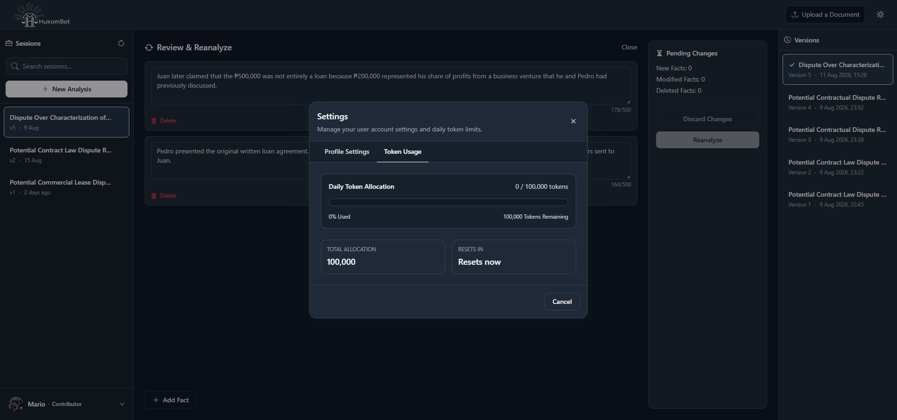

# HukomBot

## Installation

### 1. Install GPU-Accelerated PyTorch

HukomBot uses GPU acceleration for supported ML workloads. This requires a system with a **CUDA 12.1+ compatible NVIDIA driver**.

```bash
pip install torch torchvision torchaudio --index-url https://download.pytorch.org/whl/cu121
```

### 2. Install Remaining Dependencies

```bash
pip install -r requirements.txt
```

---

## Environment Configuration

Copy `.env.example` to `.env`:

```bash
cp .env.example .env
```

Then configure the required environment variables.

### Application

| Variable | Description |
|---|---|
| `BASE_PAGE_URL` | Frontend base URL |
| `BASE_API_URL` | Backend API base URL |

### PostgreSQL

| Variable | Description |
|---|---|
| `DB_HOST` | PostgreSQL host |
| `DB_PORT` | PostgreSQL port |
| `DB_NAME` | Database name |
| `DB_USER` | Database user |
| `DB_PASSWORD` | Database password |

### Redis

| Variable | Description |
|---|---|
| `REDIS_HOST` | Redis host |
| `REDIS_PORT` | Redis port |

### JWT

| Variable | Description |
|---|---|
| `JWT_SECRET` | JWT signing secret |
| `JWT_ALGO` | JWT signing algorithm |
| `JWT_ISS` | JWT issuer |
| `JWT_AUD` | JWT audience |
| `JWT_EXP_IN_MIN` | JWT expiration time in minutes |

### Google OAuth

| Variable | Description |
|---|---|
| `OAUTH_CLIENT_ID` | OAuth client ID |
| `OAUTH_CLIENT_SECRET` | OAuth client secret |
| `GOOGLE_OAUTH_REDIRECT_URI` | Google OAuth redirect URI |
| `GOOGLE_AUTH_URL` | Google OAuth authorization URL |
| `GOOGLE_TOKEN_URL` | Google OAuth token URL |

### LLM Providers

#### Google Gemini

| Variable | Description |
|---|---|
| `GEMINI_API_KEY` | Gemini API key |
| `GEMINI_MODEL` | Gemini model name |
| `GEMINI_BASE_URL` | Gemini base URL |

#### OpenRouter

| Variable | Description |
|---|---|
| `OPEN_ROUTER_API_KEY` | OpenRouter API key |
| `OPEN_ROUTER_MODEL` | OpenRouter model name |
| `OPEN_ROUTER_BASE_URL` | OpenRouter base URL |

#### NVIDIA

| Variable | Description |
|---|---|
| `NVIDIA_API_KEY` | NVIDIA models API key |
| `NVIDIA_MODEL` | NVIDIA model name |
| `NVIDIA_BASE_URL` | NVIDIA base URL |

### Embedding and Reranking Models

| Variable | Description |
|---|---|
| `HP_API_KEY` | Hugging Face API key |
| `EMBEDDING_MODEL` | Embedding model name |
| `EMBEDDING_DEVICE_CPU` | Embedding CPU device label |
| `EMBEDDING_DEVICE_GPU` | Embedding GPU device label |
| `RERANKER_MODEL` | Reranker model name |
| `RERANKER_DEVICE_CPU` | Reranker CPU device label |
| `RERANKER_DEVICE_GPU` | Reranker GPU device label |

### Token Quota

| Variable | Description |
|---|---|
| `TOKEN_QUOTA_DAILY` | Daily token quota limit |
| `TOKEN_QUOTA_WINDOW` | Token quota window in seconds |

### Cloudinary

| Variable | Description |
|---|---|
| `CLOUDINARY_NAME` | Cloudinary cloud name |
| `CLOUDINARY_API_KEY` | Cloudinary API key |
| `CLOUDINARY_SECRET` | Cloudinary secret |

---

# API Endpoints

All API endpoints use the `/api/v1` base path.

| Method | Path | Auth | Roles | Rate Limit | Description |
|--------|------|------|-------|------------|-------------|
| `GET` | `/api/v1/auth/me` | Yes | Any | 60 req/min | Get current user profile |
| `GET` | `/api/v1/auth/google/login` | No | — | 10 req/min | Initiate Google OAuth |
| `GET` | `/api/v1/auth/google/login/callback` | No | — | 10 req/min | Handle Google OAuth callback |
| `GET` | `/api/v1/auth/logout` | Yes | Any | 20 req/min | Log out the current user |
| `GET` | `/api/v1/users/` | Yes | `admin` | 60 req/min | List/search all users |
| `GET` | `/api/v1/users/me` | Yes | Any | 60 req/min | Get current user profile |
| `GET` | `/api/v1/users/me/usage` | Yes | `standard`, `contributor` | 60 req/min | Get daily token quota usage |
| `PATCH` | `/api/v1/users/{user_id}` | Yes | Any (admin for `role` field) | 10 req/min | Update user profile |
| `DELETE` | `/api/v1/users/{id}` | Yes | `admin` | 60 req/min | Delete a user account |
| `GET` | `/api/v1/documents/` | Yes | `admin` | 60 req/min | List/search all documents |
| `POST` | `/api/v1/documents/` | Yes | Any | 5 req/min | Upload a document |
| `GET` | `/api/v1/documents/{id}` | Yes | `admin` | 60 req/min | Get document by ID |
| `PATCH` | `/api/v1/documents/{id}` | Yes | `admin` | 10 req/min | Update document metadata |
| `PATCH` | `/api/v1/documents/{id}/approve` | Yes | `admin` | 10 req/min | Approve a document |
| `GET` | `/api/v1/documents/{id}/upload-status` | Yes | Any | 60 req/min | Get document upload status |
| `GET` | `/api/v1/admin/dashboard` | Yes | `admin` | 60 req/min | Get admin dashboard data |
| `GET` | `/events/v1/admin/dashboard` | Yes | `admin` | — | Stream admin dashboard updates (SSE) |
| `POST` | `/api/v1/case-analyses/` | Yes | `standard`, `contributor` | 5 req/min | Run case analysis |
| `GET` | `/api/v1/case-analyses/` | Yes | `standard`, `contributor` | 60 req/min | List the user's case analysis sessions |
| `GET` | `/api/v1/case-analyses/{id}/versions` | Yes | `standard`, `contributor` | 60 req/min | List versions of a case analysis session |
| `GET` | `/api/v1/case-analyses/{id}/versions/{v}` | Yes | `standard`, `contributor` | 60 req/min | Get a specific case analysis version |
| `DELETE` | `/api/v1/case-analyses/{id}` | Yes | `standard`, `contributor` | 10 req/min | Delete a case analysis session |

---

# Token Quota

HukomBot enforces a **daily AI token quota** using Redis and a Lua script during case analysis generation.

The current user's quota usage can be retrieved through:

```http
GET /api/v1/users/me/usage
```

The response is wrapped in a `SuccessResponse` envelope:

```json
{
  "success": true,
  "data": {
    "quota": 100000,
    "remaining": 75000,
    "ttl": 3600
  }
}
```

The response fields are:

| Field | Description |
|---|---|
| `quota` | User's total daily token quota |
| `remaining` | Number of tokens remaining |
| `ttl` | Remaining lifetime of the current quota window in seconds |

---

# Image Storage

Profile pictures are stored using **Cloudinary**.

The `UserOrchistrator.update_pipeline()` method:

1. Validates the uploaded image.
2. Accepts JPG, JPEG, and PNG files.
3. Enforces a maximum file size of **5 MB**.
4. Uploads the image to Cloudinary.
5. Stores the resulting URL in the user's `profile_picture` field.
6. Removes the uploaded Cloudinary image if the database transaction fails.

This provides rollback behavior for failed profile updates, preventing orphaned uploaded images.

---

# Changelog

## Added

### Frontend

- Added a React + Vite frontend application under `frontend/hukom_bot`.
- Added TypeScript, ESLint, and path alias configuration.
- Added the login page route.
- Added reusable UI components:
  - `LoginCard`
  - `Logo`
  - `ProviderButton`
  - `ThemeToggle`
- Added sitewide theme context/provider.
- Added centered layout primitives for authentication views.
- Added Bootstrap Icons integration.
- Added `SettingsModal` with:
  - Profile Settings tab
  - Token Usage tab
- Added `userService.ts` with:
  - `updateUserProfile()`
  - `getUserTokenUsage()`
- Added `UserTokenUsageResponse` type.
- Added a user profile dropdown to `SessionExplorer`.
- Added Settings and Sign Out actions.
- Added a Settings trigger to `Header`.
- Added `refreshUser()` to `WorkspaceContext`.

### Backend

- Added the `case_analysis_answer_format` enum and supporting caster, repository, and schema components for the case analysis version flow.
- Reintroduced the case analyses endpoint module:
  - `backend/hukom_bot/api/v1/endpoint/case_analysis.py`
- Added:

  ```http
  GET /api/v1/users/me/usage
  ```

  for retrieving authenticated user token quota usage.
- Added:

  ```http
  PATCH /api/v1/users/{user_id}
  ```

  for updating user profiles through `multipart/form-data`.
- Added rate limiting:
  - `PATCH /users/{user_id}` — 10 requests/minute
  - `GET /users/me` — 60 requests/minute
  - `GET /users/me/usage` — 60 requests/minute
- Added Redis-backed, Lua-scripted token quota middleware.
- Added `TokenQuotaUsage` schema containing:
  - `quota`
  - `remaining`
  - `ttl`
- Added `profile_picture` to `UserResponse`.
- Updated `UserCaster.base_to_response` to include `profile_picture`.
- Added `UserOrchistrator` with `update_pipeline()` for:
  - Profile updates
  - File validation
  - Cloudinary image uploads
  - Authorization checks
  - Database transactions
  - Transaction rollback
- Added `get_user_orchistrator` dependency injection.
- Added:
  ```http
  PATCH /api/v1/documents/{document_id}
  ```
  for updating document metadata (original file name, document type, upload status) through `DocumentUpdatePayload`.
- Added `DocumentOrchistrator.update_pipeline()` with:
  - Status transition validation (no reverting to prior states, no FAILED after COMPLETED)
  - Forbidden `ONGOING` status transitions (must use the approve endpoint instead)
  - `REJECTED` status handling with file deletion and `rejection_message` enforcement
- Added Role-Based Access Control (RBAC):
  - Added `role` field to `JWTPayload`
  - Added `require_role` dependency injection function
  - Added `UserRole` enum (`standard`, `contributor`, `admin`)
- Added role guards on endpoints:
  - `standard`, `contributor` required: `GET /users/me/usage`, all `case-analyses` endpoints
  - `admin` required: `PATCH /documents/{id}`, `PATCH /documents/{id}/approve`, `GET /documents/`, `GET /documents/{id}`
- Added:
  ```http
  GET /api/v1/users/
  ```
  for listing/searching all users (admin only).
- Added:
  ```http
  DELETE /api/v1/users/{user_id}
  ```
  for deleting user accounts (admin only).
- Added:
  ```http
  GET /api/v1/documents/
  ```
   for listing/searching documents (admin only).
- Added:
  ```http
  GET /api/v1/documents/{document_id}
  ```
   for retrieving a single document by ID (admin only).
- Added:
  ```http
  GET /api/v1/admin/dashboard
  ```
   for retrieving admin dashboard data with aggregated counts (admin only).
- Added:
  ```http
  GET /events/v1/admin/dashboard
  ```
  for streaming real-time admin dashboard updates via Server-Sent Events (SSE) (admin only).
- Added `PubsubService` class wrapping Redis pub/sub for publish/subscribe messaging.
- Added `ADMIN_DASHBOARD_CH` configuration variable for the Redis channel name.
- Added publish (trigger) statements to document and user actions that update admin dashboard statistics.
- Added `role` field to the JWT payload emitted at login.
- Added `AuthContext` (`AuthContext.tsx`) for frontend auth state management.
- Added `RequireAuth` wrapper in `App.tsx` for protected route rendering.
- Added `user.ts` type definitions for frontend.
- Added `UserSearch` schema with query-based search and `OrderableMixin` for sortable columns.
- Added `DocumentSearch` schema with query-based search and `OrderableMixin`.
- Added `DocumentResponse` schema with nested `UserResponse` for the uploader.
- Added `UserGetAll` and `DocumentGetAll` schemas for non-search list endpoints.
- Added `OrderableMixin` and `OrderEnum` (`ASC`/`DESC`) for sortable list responses.
- Added `AdminDashboardData` schema with aggregated counts for active users, documents by status, and chunks.
- Added `rejection_message` field to `DocumentCreate`, `DocumentUpdateBase`, and `DocumentResponse` schemas.
- Added `rejected` value to the `UploadStatus` enum with status level `-1` and state transition logic in `DocumentOrchistrator.update_pipeline()`.
- Made `uploader` field optional (`UserResponse | None`) in `DocumentResponse` schema.

## Changed

### Backend Structure

- Renamed the backend package namespace from:

  ```text
  backend.app
  ```

  to:

  ```text
  backend.hukom_bot
  ```

  across API, services, repositories, schemas, and utilities.

### Frontend Architecture

- Migrated the frontend from the legacy Python/HTML page structure to a modern React component architecture.
- Updated theme toggle icon styling.
- Applied theme handling globally.
- Created `AuthContext` as the single source of truth for authentication state on the frontend, replacing inline auth checks in `WorkspaceContext`.
- Updated `App.tsx` with a `RequireAuth` wrapper that gates `/workspace` behind `standard` or `contributor` roles.
- Separated user-related types (`UserRole`, `UserResponse`, `UserTokenUsageResponse`) into `frontend/hukom_bot/src/types/user.ts`.
- Updated logout handling to use the async `logout()` service function directly instead of `getLogoutUrl()` + `window.location.href`.
- Updated `WorkspaceContext` to consume `AuthContext` instead of fetching the current user independently.
- Updated `SessionExplorer` session list to render sorted by `updated_at` descending (most recent first).

### User API

The user update endpoint was restructured.

Previously:

```http
PATCH /users/me
```

with a JSON request body.

Now:

```http
PATCH /users/{user_id}
```

using `multipart/form-data` with form fields and an optional file upload.

The endpoint now uses `UserOrchistrator` for authorization and transactional updates.

### Token Usage API

The response from:

```http
GET /users/me/usage
```

is now wrapped in a `SuccessResponse` envelope containing:

```json
{
  "success": true,
  "message": "...",
  "data": {},
  "result": {}
}
```

### User Response

- Updated `UserCaster` to include `profile_picture` when converting to `UserResponse`.
- Added `role` claim to `JWTPayload` and included it in the JWT emitted at login.
- Added `require_role` dependency that validates the `role` claim against allowed roles.
- Added role guards to all case analysis endpoints, document update/approve endpoints, user token usage endpoint, document listing, and document retrieval by ID endpoints.
- Updated `rate_limit` dependency to use injected `JWTService` instead of instantiating it inline.
- `GET /users/me` success message changed from "User fetched successfully" to "User retrieved successfully".
- `GET /users/me/usage` success message changed from "User token usage retrive successfully" to "User token usage retrieved successfully".
- `UserSearch` schema restructured to use generic `query` field with `OrderableMixin` instead of separate `first_name`/`last_name`/`email`/`provider` fields.
- `DocumentSearch` schema restructured to use generic `query` field with `OrderableMixin`.
- Added `model_validator` on `DocumentUpdateBase` to enforce: `rejection_message` required when `upload_status` is `rejected`, and `upload_status` required when `rejection_message` is provided.

### Dependency Injection

- Consolidated the `DocumentOrchistrator` import in `dependency.py`.
- Added a trailing comma for consistency.

### Workspace UI

- Refactored `SessionExplorer` to accept:
  - `onSettingsClick`
  - `onSignOut`
- Added a user profile footer with a dropdown menu.
- Updated `Header` to accept `onSettingsClick`.
- Moved user name display from `Header` to the `SessionExplorer` footer.
- Updated the `Workspace` page to manage `settingsModalOpen` state and connect the settings modal.

### Document API

The approve document endpoint was changed from:

```http
POST /documents/{document_id}/approve
```

to:

```http
PATCH /documents/{document_id}/approve
```

A new endpoint was also added:

```http
PATCH /documents/{document_id}
```

for updating document metadata.

---

## Removed

### Legacy Frontend

Removed the legacy frontend Python templates, routers, scripts, styles, and helper modules under:

```text
frontend/
```

### User Service

- Removed the direct `UserService` dependency from the user endpoint.
- Replaced it with `UserOrchistrator`.

### User Endpoint Imports

- Removed the old `Body` import.
- Replaced it with:
  - `Form`
  - `File`
  - `UploadFile`
- Removed `getLogoutUrl()` from frontend `authService.ts`.
- Replaced it with an async `logout()` that calls the API and redirects on completion.

### Header User Display

- Removed direct `first_name`/user name display from `Header`.
- User information is now displayed in the `SessionExplorer` profile footer.

---

### Screenshots








